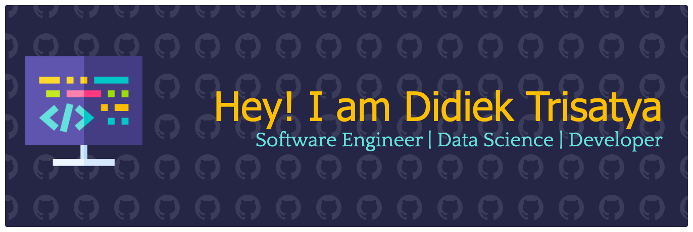

# 👋 Hi, I'm Trisatya Programming

  
  

---

## 🚀 About Me

Passionate software developer with expertise in building modern, scalable applications. I love turning complex problems into elegant solutions and contributing to open-source projects.

- 🔭 Currently working on **innovative web applications** and **cloud-native solutions**
- 🌱 Learning **microservices architecture**, **DevOps practices**, and **AI/ML integration**
- 🤝 Open to collaborate on **open-source projects** and **impactful tech solutions**
- 💬 Ask me about **web development**, **data science**, **API development**

---

## 🛠️ Tech Stack

### Languages

### Frontend

### Backend

### Database

### DevOps & Tools

---
<!--
## 📊 GitHub Statistics

  
  
  
  

---

## 📈 Contribution Graph

###

###

-->

## 📫 Let's Connect

**Open to opportunities and collaborations!**

Feel free to reach out if you want to discuss technology, collaborate on projects, or just have a chat about coding.

  
  
  
  

---

  
  
  

